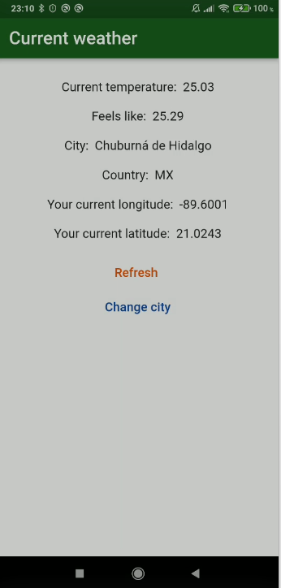
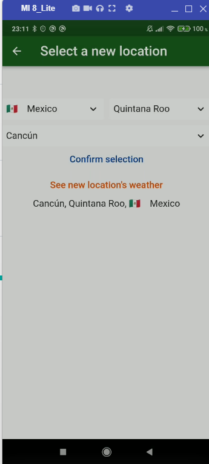
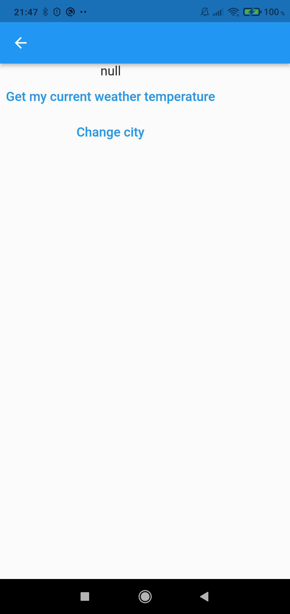

# weather_api_app

git branch 26_weather_app_ui_api_update && git checkout 26_weather_app_ui_api_update && git add . && git commit -m "26_weather_app_ui_api_update" && git push --set-upstream origin 26_weather_app_ui_api_update

# App Screens

## Screenshots

