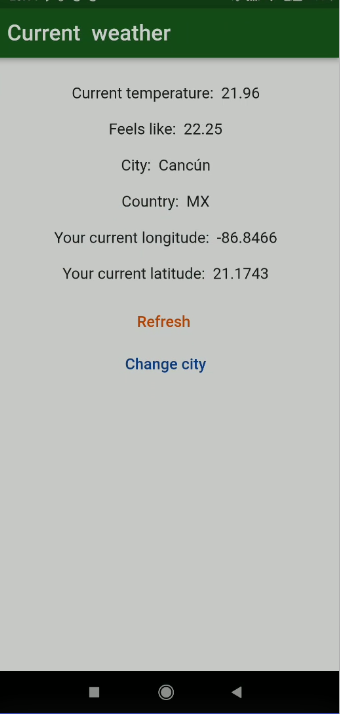

# weather_api_app

git branch 25_ad_listing_with_networking && git checkout 25_ad_listing_with_networking && git add . && git commit -m "25_ad_listing_with_networking" && git push --set-upstream origin 25_ad_listing_with_networking

# App Screens

## Screenshots

